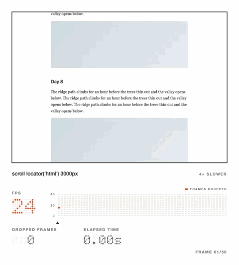
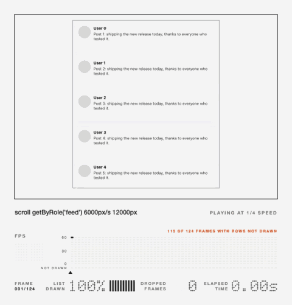

# playwright-smoothness

Smoothness checks for [Playwright](https://playwright.dev). It measures interactions and list scrolling in Chromium, compares each one with a stored baseline, and tells you which element and which code got slower.



This demo journal scrolls itself with a script that moves the page on every frame. Half its frames are dropped, so it runs at about 30 frames per second. No single frame took 50ms, so the browser's Long Animation Frames API reported nothing. The dropped frames came from Chrome's own frame timeline. When a check like this gets worse, the test gets this replay attached.

It only warns until you switch a check to fail, has no third-party runtime dependencies, and sends no data anywhere. The [FAQ](docs/faq.md) covers how much time it adds to a suite, how it stays steady in CI, and how it differs from Lighthouse and real-user monitoring.

## Install

```bash
npm install -D playwright-smoothness
```

It needs Node 20 or later and `@playwright/test` 1.49 or later. Measurements run in Chromium, and new headless mode is closest to real Chrome:

```ts
// playwright.config.ts
use: { browserName: 'chromium', channel: 'chromium' },
```

## Usage

### Measure every test

```ts
// tests/fixtures.ts
import { test as base } from '@playwright/test';
import { withSmoothness } from 'playwright-smoothness';
export const test = withSmoothness(base, { auto: true });
export { expect } from '@playwright/test';
```

Tests that import `test` from this file are measured as they run, with no other changes. Each test is measured once across its whole run, and every interaction is listed with its element, such as `click on button#checkout: 180ms`. A test is compared with the median of its recent passing runs on your main branch, and anything that got worse gets an annotation. [Automatic mode](docs/automatic-mode.md) covers how that history is kept in CI.

### Measure an interaction

```ts
// tests/smoothness.spec.ts
import { test, expect } from 'playwright-smoothness';

test('filters open smoothly', async ({ page, smoothness }) => {
  await page.goto('/articles');
  const result = await smoothness.measure('open filters', async () => {
    await page.getByRole('button', { name: 'Filters' }).click();
  });
  expect(result).toBeSmooth();
});
```

`measure()` slows the CPU 4x, runs your action once as a warm-up, then reloads the page and runs it 5 more times, waiting each time until the page has loaded and gone quiet. It reports the median of each number. Only work caused by the interaction counts: frames from page load, background timers and `setInterval` callbacks are left out.

That takes several times as long as the interaction itself, so these tests usually need a longer `timeout` than Playwright's 30-second default.

If a plain reload doesn't put the page back in the state your action needs, `reset` does it instead:

```ts
await smoothness.measure('add to cart', action, {
  reset: async ({ page }) => {
    await page.goto('/product/42');
    await page.getByRole('button', { name: 'Accept cookies' }).click();
  },
});
```

### Scroll a list



A list can go blank without dropping a frame. This demo feed builds its posts too slowly, so it keeps 60 frames per second while the list is empty in 114 of 122 frames. `scroll()` measures both.

```ts
test.use({ hasTouch: true }); // input: 'touch' needs a touch-enabled context

test('catalog flick stays drawn', async ({ page, smoothness }) => {
  await page.goto('/catalog');
  const result = await smoothness.scroll(page.getByRole('list', { name: 'Trending' }), {
    mode: 'full', // blank rows need the trace's screenshots
    input: 'touch', // 'wheel' (default) | 'touch' | 'keys'
    speed: 'fast', // 'slow' | 'normal' (default) | 'fast' | pixels per second
    distance: 20_000, // 'end' (default) | pixels
  });
  expect(result).toBeSmooth();
});
```

`scroll()` makes the same repeated, reloaded runs as `measure()`, with the scroll as the action:

- `'wheel'` sends a wheel gesture that the compositor scrolls.
- `'touch'` flicks with real touch events, and throws in a context without touch support (`hasTouch: true`, or a mobile device).
- `'keys'` presses the arrow keys 100ms apart and measures each press as an interaction.
- `direction` is `'vertical'` (default) or `'horizontal'`.
- `distance: 'end'` stops after 20,000px, and the result says how far the end really was. A pixel distance isn't capped.

In full mode, `scroll()` also counts blank frames: frames where the list was drawn to less than half of how it looks at rest. They mean rows that weren't built in time, which only happens in a virtualized list (one that removes rows as they scroll away and builds new ones). `scroll()` detects that by watching for removed rows, and only gates blank frames on a virtualized list. `list: { virtualized: true }` overrides the detection, and `list.placeholders` makes skeleton rows count as blank:

```ts
await smoothness.scroll(list, { mode: 'full', list: { placeholders: ['.skeleton-row', '#e5e7eb'] } });
```

If the list never moves, for example because the locator isn't the element that scrolls, its blank-frame numbers are reported as unavailable, not as 0%. [List detection](docs/list-detection.md) explains how blank frames are found and what the detection can't see.

### Replays

When a full-mode `measure()` or `scroll()` check gets worse, a video of one run is attached to the test in the Playwright report, played at a quarter of real speed. Under the recording it shows the frame rate at each moment, in red while frames are being dropped, beside a chart of the frame rate across the run with the elapsed time under the playhead. For `scroll()`, a frame where the list is blank is outlined and tagged. `replay: 'on'` attaches one every time, and `'off'` never does. `measure()` makes one extra run for its replay, because screenshots take compositor time, and that run is never counted.

## Baselines

The first run records a baseline next to your test, the way `toMatchSnapshot()` does, and passes. Later runs compare with it, and `npx playwright test --update-snapshots` records it again: `=all` replaces every baseline, `=changed` only those that got worse, and `=none` never writes. Renaming a test starts a new baseline.

A baseline belongs to one machine. Its key includes the label, test, project, platform, mode, refresh rate, CPU throttling and CPU model, because the same work took 150ms, 197ms or 226ms on different GitHub-hosted runners ([measurements](docs/measurements.md)). A baseline from your laptop isn't used in CI. In CI, baselines come from your main branch through `baselineDir`, and a run on a CPU model with no baseline yet skips its checks. The [CI guide](docs/ci.md) has a GitHub Actions recipe, and a dedicated or self-hosted runner gives the steadiest numbers.

## Results

| Field                        | Meaning                                                                                                     | Gated    |
| ---------------------------- | ----------------------------------------------------------------------------------------------------------- | -------- |
| `input.p95ToPaintMs`         | Time from input (a click, tap or key press) to the next paint, 95th percentile, from Event Timing.          | Yes      |
| `input.byTarget`             | The same, per element, such as `click on button#checkout`.                                                  | No       |
| `longFrames.count`           | Animation frames over 50ms caused by the interaction, from the Long Animation Frames API.                   | Yes      |
| `longFrames.totalBlockingMs` | Frame time beyond 50ms, added up. It's noisy, so it's only gated with `gateTotalBlocking: true`.            | Optional |
| `longFrames.topScripts`      | The scripts that ran in those frames, with the interactions they blocked (`during`).                        | No       |
| `frames.onTimePercent`       | Full mode: frames presented on time, out of those with an update to show. Catches drops too short for LoAF. | Yes      |
| `frames.dropped`             | Full mode: frames that missed their deadline.                                                               | No       |
| `list.blankFramePercent`     | Full-mode `scroll()`: frames where the list was less than half drawn. Gated on a virtualized list only.     | Yes      |
| `list.leastDrawnPercent`     | Full-mode `scroll()`: the emptiest frame, as a percentage of the list at rest.                              | No       |
| `profile.hotFunctions`       | Full mode: the functions that used the most CPU, with their callers, from V8's sampling profiler.           | Never    |
| `budget120`                  | Full mode with `refreshRate: 120`: main-thread frames over 8.33ms, a prediction for 120Hz screens.          | Never    |

A check gets worse when it grows by more than `maxIncrease` (15% by default) over its baseline, with a small floor so rounding can't trip it: 16ms of input-to-paint, 1 long frame, or 1 percentage point. On-time frames are compared on the share that was missed, so a fall from 95% to 81% can't pass as "within 15%". A number that couldn't be measured is `null`, never zero, and its reason is listed in `unavailable`.

Full mode traces each run, which adds about 5–25% to its time without changing the other numbers ([trace categories](docs/trace-categories.md)). With React and Angular, the Long Animation Frames API names the framework's event dispatcher rather than your handler. The CPU profile in full mode names the handler itself, through your source maps when the build is minified ([frameworks](docs/frameworks.md)).

## Warn first, then fail

`enforce: 'warn'` is the default. A check that got worse adds a `smoothness-warning` annotation, prints the full report and, in GitHub Actions, a `::warning` on the pull request, but the test passes. Once you trust a check, `'fail'` makes it fail the test:

```ts
test.use({ smoothnessOptions: { enforce: 'fail' } });
// or for one assertion
expect(result).toBeSmooth({ enforce: 'fail' });
```

The message starts with what got worse and the scripts responsible:

```
"checkout" is less smooth than its baseline:
  input-to-paint (p95) 64ms (+48ms, +300%), slowest: click on button#heavy

Scripts blocking the interaction:
  1. onHeavyClick in click.js (BUTTON#heavy.onclick): ran 60ms, 12.6ms of it blocking, during click on button#heavy
```

## Options

Options can be set for a whole project, for a file with `test.use({ smoothnessOptions: { ... } })`, or for one call as the last argument to `measure()` or `scroll()`:

```ts
// playwright.config.ts
import { defineConfig } from '@playwright/test';
import type { SmoothnessTestOptions } from 'playwright-smoothness';

export default defineConfig<SmoothnessTestOptions>({
  use: { channel: 'chromium', smoothnessOptions: { runs: 3 } },
});
```

| Option              | Default                                                         | Description                                                                                  |
| ------------------- | --------------------------------------------------------------- | -------------------------------------------------------------------------------------------- |
| `runs`              | `5`                                                             | Measured runs. The median is reported.                                                       |
| `cpuThrottling`     | `4`                                                             | How many times slower the CPU runs. `1` turns throttling off.                                |
| `maxIncrease`       | `0.15`                                                          | Allowed increase over the baseline.                                                          |
| `enforce`           | `'warn'`                                                        | `'warn'` or `'fail'`.                                                                        |
| `reset`             | `'reload'`                                                      | `'reload'`, `'none'`, or an async function.                                                  |
| `baselineDir`       | none                                                            | A folder of baselines from your main branch, checked before the ones next to the test.       |
| `gateTotalBlocking` | `false`                                                         | Also gate total blocking time.                                                               |
| `mode`              | `'quick'`                                                       | `'full'` adds a Chrome trace: dropped frames, a CPU profile and, for `scroll()`, blank rows. |
| `list`              | `{ background: 'auto', placeholders: [], virtualized: 'auto' }` | Full-mode `scroll()`: what counts as blank, and whether the list is virtualized.             |
| `replay`            | `'on-regression'`                                               | Full mode: when to attach a replay (`'on'`, `'off'`).                                        |
| `refreshRate`       | `60`                                                            | `120` adds a 120Hz prediction in full mode that's reported but never gated.                  |

The mode can also come from the `SMOOTHNESS_MODE` environment variable, and scheduled CI runs use full mode by default ([mode detection](docs/mode-detection.md)).

## Reporter

```ts
// playwright.config.ts
reporter: [['list'], ['playwright-smoothness/reporter']],
```

The reporter writes `test-results/smoothness/summary.md`: each check's change against its baseline, such as `129ms (+20ms, +18%)`, the scripts and functions behind anything that got worse, and anything that couldn't be measured or compared. In GitHub Actions it's added to the job summary too. Its options are `outputFile`, `title` and `githubSummary`. Every result is also written as JSON (`schemaVersion: 1`) under `test-results/smoothness/` and attached to the test.

## Choose `maxIncrease`

```bash
npx playwright-smoothness calibrate --runs 5 -- --project=chromium
```

`calibrate` runs your suite 5 times on unchanged code, without comparing or recording baselines, and prints how much each check moved between runs. For each check it suggests the smallest `maxIncrease`, in steps of 0.05, that covers that movement, and warns when a check needs more than the default. Arguments after `--` go to `playwright test`, and the results are also saved to `smoothness-calibration.json`. Run it on the machine that gates your builds, since that's where the noise matters.

## CI

On the main branch, CI records baselines with `--update-snapshots=all` and uploads them. Pull requests download them and point `baselineDir` at them, so every check compares against main. Pull requests run in quick mode, and scheduled runs switch to full mode on their own. The [CI guide](docs/ci.md) has the whole recipe, including posting the summary on the pull request, and [`examples/github-actions`](examples/github-actions) has the workflow ready to copy.

## Limitations

- It measures in Chromium only. In Firefox and WebKit, measurements are skipped with a `smoothness-skipped` annotation.
- Long frames and scripts come from the main thread, so jank on the compositor thread isn't blamed on any script.
- Headless Chrome runs at 60Hz, so 120Hz numbers are a prediction.
- Event Timing doesn't report interactions under 16ms, so `input.interactions` only counts slower ones.
- An action that navigates to a new page can't be measured, and the result says so.

## Documentation

- [FAQ](docs/faq.md): suite time, flakiness, requirements, privacy, and how it compares with Lighthouse and real-user monitoring
- [CI](docs/ci.md): baselines in GitHub Actions, dedicated runners, full mode on a schedule, and the pull-request summary
- [Automatic mode](docs/automatic-mode.md): measuring every test with `withSmoothness()`
- [List detection](docs/list-detection.md): how blank rows are found, and replays
- [Frameworks](docs/frameworks.md): React, Angular, and naming your handler through the CPU profile
- [How it works](docs/how-it-works.md): the browser signals used, how frames are classified, and how baselines are compared
- [Measurements](docs/measurements.md): the evidence behind the defaults

## Examples

- [`examples/plain-site`](examples/plain-site): a static page with a button and a long list. CI tests the baseline recipe against it.
- [`examples/react-list`](examples/react-list): a minified React windowed list, where full mode names the slow component through source maps.
- [`examples/github-actions`](examples/github-actions): the CI workflow from the CI guide.
- [`demos`](demos): seven small apps, each with a fast and a slow version, from a trail journal to a design board.

## Packages

This repository publishes two packages. `playwright-smoothness` is the one to install. It depends on [`smoothness-core`](packages/smoothness-core), the measuring engine, which other browser libraries can drive through a small adapter.

## License

MIT
